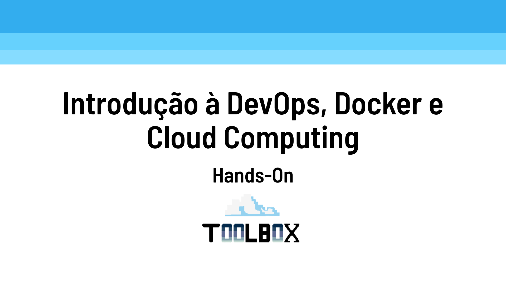

# Mini Curso IFSP


<a href="https://docs.google.com/presentation/d/e/2PACX-1vTkr15PAkf7aTexkYRFHHB8Ro32c4R20aWf7dTKRDm2QY3FmUoZ9z3NAl17LeLAw0rUNP0Rc3u6fmOq/pub?start=false&loop=false&delayms=3000" target="_blank">
  
</a>

<a href="https://docs.google.com/presentation/d/e/2PACX-1vTkr15PAkf7aTexkYRFHHB8Ro32c4R20aWf7dTKRDm2QY3FmUoZ9z3NAl17LeLAw0rUNP0Rc3u6fmOq/pub?start=false&loop=false&delayms=3000" target="_blank">
  Slides
</a>

Neste mini-curso serão abordados conceitos essenciais e práticas relacionadas ao DevOps, Docker e Cloud Computing. 

Primeiramente, discutirá o conceito de DevOps, seguido de uma aplicação prática com a criação de um ciclo de CI/CD utilizando pipelines. 

Em seguida, será apresentado o conceito de Docker e, na prática, o processo de build de uma aplicação utilizando containers. Por fim, a oficina tratará do conceito de Cloud Computing, encerrando com uma demonstração de como realizar o primeiro deployment na nuvem.


## O que é o Mini Curso IFSP

Este repositório serve como laboratório para a prática e o uso do GitHub Actions para criação de pipelines que possuem a finalizade de automatizar o processo de CI/CD build, testes e deploy na Cloud Run

## GitHub Actions
O GitHub Actions é uma plataforma de automação que permite criar fluxos de trabalho personalizados para o seu repositório. Neste desafio, utilizamos o GitHub Actions para executar as seguintes etapas:

1. **Build**: O fluxo de trabalho inicia com a compilação do código-fonte do projeto.
2. **Testes**: Em seguida, são executados os testes automatizados para garantir a qualidade do código.
3. **Build e Push da imagem Docker para o Docker Hub**: Realiza o build da imagem docker e envia para o Docker Hub
4. **Run Docker Container**: Faz o pull da image Docker criada e realiza testes.
5. **Deploy na Cloud Run**: Por fim, o fluxo de trabalho realiza o deploy do projeto na Cloud Run, uma plataforma de execução de contêineres gerenciada pelo Google Cloud.

## Arquivo yml

O arquivo que faz a pipeline deste repositório é o [ci-cd.yml](./.github/workflows/ci-cd.yml)

```yaml
name: CI/CD Pipeline

on: # Define os eventos que acionam o workflow
  push: # Aciona o workflow quando há um push
    paths:
      - 'nodejs/**' # Define o diretório que aciona o workflow
  workflow_dispatch: # Aciona o workflow manualmente
    inputs: # Define os inputs do workflow
      name: # Nome do input
        description: 'Trigger manual do Workflow' # Descrição do input para acionamento manual

jobs: # Define os trabalhos a serem execut
  build: # Nome do trabalho
    name: Build Docker image # Nome do trabalho
    runs-on: ubuntu-latest # Sistema operacional em que o trabalho será executado

    steps: # Passos a serem executados no trabalho
    - name: Checkout code # Faz o checkout do código
      uses: actions/checkout@v2 # Usa a ação de checkout do repositório

    - name: Build Docker image # Constrói a imagem Docker
      run: cd nodejs && docker build -t $DOCKER_IMAGE_NAME . # Comando para construir a imagem Docker 

    - name: Push Docker image to Docker Hub # Faz o push da imagem Docker para o Docker Hub
      env:
        DOCKER_USERNAME: ${{ secrets.DOCKER_USERNAME }} # Nome de usuário do Docker Hub
        DOCKER_PASSWORD: ${{ secrets.DOCKER_PASSWORD }} # Senha do Docker Hub
        DOCKER_REPOSITORY: ${{ vars.DOCKER_REPOSITORY }} # Repositório Docker
        DOCKER_IMAGE_NAME: ${{ vars.DOCKER_IMAGE_NAME }} # Nome da Imagem Docker
        COMMIT_SHA: ${{ github.sha }} # SHA do commit
        COMMIT_ACTOR: ${{ github.actor }} # Autor do commit
      # Comando para fazer o login no Docker Hub, tag da imagem Docker e push da imagem Docker
      run: |
        echo $DOCKER_PASSWORD | docker login -u $DOCKER_USERNAME --password-stdin # Login no Docker Hub
        docker tag $DOCKER_IMAGE_NAME $DOCKER_REPOSITORY/$DOCKER_IMAGE_NAME:$COMMIT_ACTOR-$COMMIT_SHA # Tag da imagem Docker
        docker push $DOCKER_REPOSITORY/$DOCKER_IMAGE_NAME:$COMMIT_ACTOR-$COMMIT_SHA # Push da imagem Docker

    - name: Run Docker image # Executa a imagem Docker
      env: # Define as variáveis de ambiente
        DOCKER_REPOSITORY: ${{ vars.DOCKER_REPOSITORY }} # Repositório Docker
        DOCKER_IMAGE_NAME: ${{ vars.DOCKER_IMAGE_NAME }} # Nome da Imagem Docker
        COMMIT_ACTOR: ${{ github.actor }} # Autor do commit
        COMMIT_SHA: ${{ github.sha }} # SHA do commit
      run: docker run -d -p 8080:8080 --name nodejs $DOCKER_REPOSITORY/$DOCKER_IMAGE_NAME:$COMMIT_ACTOR-$COMMIT_SHA # Executa o container Docker

    - name: Wait for Container to be ready # Espera o container estar pronto
      run: sleep 10 # Espera 10 segundos

    - name: Check if container is running # Verifica se o container está rodando
      run: docker ps -f 'name=nodejs' # Checa se o container está rodando

    - name: Test Docker image # Testa a imagem Docker
      run: curl http://localhost:8080 # Faz uma requisição HTTP para o container

  cloud_run:
    name: Deploy on Cloud Run # Nome do trabalho
    runs-on: ubuntu-latest # Sistema operacional em que o trabalho será executado
    needs: build # Define que o trabalho depende do trabalho "build"
    permissions: # Define as permissões necessárias
      contents: 'read' # Permissão de leitura
      id-token: 'write' # Permissão de escrita
    
    steps: # Passos a serem executados no trabalho

    - name: Checkout repository # Faz o checkout do repositório
      uses: actions/checkout@v2 # Usa a ação de checkout do repositório

    - name: Deploy on Cloud Run # Faz o deploy da aplicação no Cloud Run
      uses: 'google-github-actions/auth@v2' # Usa a ação de autenticação do Google Cloud
      with: # Define as variáveis de autenticação
        workload_identity_provider: ${{ secrets.WORKLOAD_IDENTIFIER_PROVIDER }} # Provedor de identidade do workload
        service_account: ${{ secrets.SERVICE_ACCOUNT }} # Conta de serviço
      
    - id: 'deploy' # Define um ID para o passo
      uses: 'google-github-actions/deploy-cloudrun@v2' # Usa a ação de deploy no Cloud Run
      with: 
        service: ${{ github.actor }} # Nome do serviço no Cloud Run
        image: "${{ vars.DOCKER_REPOSITORY }}/${{ vars.DOCKER_IMAGE_NAME }}:${{ github.actor }}-${{ github.sha }}" # Imagem a ser usada no Cloud Run
        flags: '--allow-unauthenticated' # Flags para o deploy no Cloud Run que libera o acesso para usuários não autenticados

    - name: 'Access Cloud Run' # Usa o CLI do Google Cloud
      run: "curl -s ${{ steps.deploy.outputs.url }}" # Acessa o Cloud Run
      continue-on-error: true # Continua a execução mesmo se houver erro
```

## Action Secrets

As varáveis abaixo devem ser salvas como `Secrets` no GitHub Actions

1. DOCKER_USERNAME: Usuário do Docker Hub
2. DOCKER_PASSWORD: Access Tokens gerado no Docker Hub. Link de como fazer [Access Token](https://docs.docker.com/security/for-developers/access-tokens/)
3. WORKLOAD_IDENTIFIER_PROVIDER: URL do Pool do Identificador de Carga de Trabalho
4. SERVICE_ACCOUNT: Conta de serviço do GCP utilizada pelo WIF

## Repository variables

A varável abaixo deve ser salva como `Repository Variables` no GitHub Actions

DOCKER_REPOSITORY: Nome do seu repositório no Docker Hub

## Deploy na Cloud Run

A Cloud Run é uma plataforma de execução de contêineres gerenciada pelo Google Cloud. Para realizar o deploy na Cloud Run, é necessário seguir os seguintes passos:

1. Criar um Workload Identifier Federation (WIF) para autenticar as ações do GitHub.
2. Configurar o Workload Identifier Federation no projeto do Google Cloud.
3. Adicionar o Workload Identifier Provider e o Service Account aos segredos do GitHub no repositório.
4. Utilizar a ação do GitHub Marketplace Action [Deploy Cloud Run](https://github.com/marketplace/actions/deploy-to-cloud-run) para realizar o deploy na Cloud Run.
5. Configurar as permissões de acesso na Cloud Run para permitir invocações não autenticadas.

Após realizar o deploy, é possível acessar a Cloud Run para verificar o serviço e configurar a autenticação, se necessário.

A conta ou chave de serviço utilizada na criação do WIF deverá ter as seguintes permissões necessárias para a criação do Cloud Run:

1. Cloud Run:
- roles/run.admin
- roles/iam.serviceAccountUser     (para atuar como a conta de serviço em tempo de execução do Cloud Run)

2. Cloud Storage:
- roles/storage.admin   (se estiver usando o Google Container Registry (gcr) em vez disso)

3. Artifact Registry
- roles/artifactregistry.admin     (nível de projeto ou repositório)

Fonte: [google-github-action](https://github.com/google-github-actions/example-workflows/blob/main/workflows/deploy-cloudrun/cloudrun-docker.yml)

 ### Leituras indicadas
 
[Cloud Run IAM permissions](https://cloud.google.com/run/docs/deploying)

[Artifact Registry IAM permissions](https://cloud.google.com/artifact-registry/docs/access-control#roles)

[Container Registry vs Artifact Registry](https://cloud.google.com/blog/products/application-development/understanding-artifact-registry-vs-container-registry)

[Principle of least privilege](https://cloud.google.com/blog/products/identity-security/dont-get-pwned-practicing-the-principle-of-least-privilege)


## Federação de Identificador de Carga de Trabalho (WIF Workload Identity Federation)

Foi utilizado neste exemplo o Workload Identity Federation (WIF), link para estudo [WIF](https://cloud.google.com/iam/docs/workload-identity-federation?hl=pt-br).

## Deploy na Cloud Run usando Workload Identifier Federation

Criando o Workload Identifier Federation. 
Fonte [Secure your use of third party tools with identity federation](https://cloud.google.com/blog/products/identity-security/secure-your-use-of-third-party-tools-with-identity-federation)

```bash
gcloud iam workload-identity-pools create ifsp-github-toolbox-actions-pool \     
--location="global" \
--description="The pool to authenticate GitHub actions." \
--display-name="IFSP GitHub Actions Pool" 
```

Lembrar de substituir assertion.repository_owner para o seu.

```bash
gcloud iam workload-identity-pools providers create-oidc ifsp-github-actions-oidc \
--workload-identity-pool="ifsp-github-toolbox-actions-pool" \
--issuer-uri="https://token.actions.githubusercontent.com/" \
--attribute-mapping="google.subject=assertion.sub,attribute.repository=assertion.repository,attribute.repository_owner=assertion.repository_owner,attribute.branch=assertion.sub.extract('/heads/{branch}/')" \
--location=global \
--attribute-condition="assertion.repository_owner=='Mini-Curso-IFSP'"
```

Lembrar de substituir a service-accounts para a sua chave de serviço, o principalSet para o seu provedor criado no GCP e nome do repositório que você quer autorizar.

```bash
gcloud iam service-accounts add-iam-policy-binding github-actions@toolbox-sandbox-388523.iam.gserviceaccount.com \
  --role="roles/iam.workloadIdentityUser" \
--member="principalSet://iam.googleapis.com/projects/794011605223/locations/global/workloadIdentityPools/ifsp-github-toolbox-actions-pool/attribute.repository/Mini-Curso-IFSP/devops"
```

Adicionar no Repository Secret
WORKLOAD_IDENTIFIER_PROVIDER = projects/794011605223/locations/global/workloadIdentityPools/ifsp-github-toolbox-actions-pool/providers/ifsp-ifsp-github-actions-oidc
SERVICE_ACCOUNT = github-actions@toolbox-sandbox-388523.iam.gserviceaccount.com

### Se não conseguir acessar pelo browser e aparecer acesso não autorizado

Após realizado o deploy:
1. Ir até [Cloud Run](https://console.cloud.google.com/run)
2. Clicar na cloud run com o seu nome
3. Clicar em `Segurança`
4. Em Autenticação, marca `Allow unauthenticated invocations` para permitir acesso a Cloud Run.

Uma recomendação do produto Cloud Run é que sistemas CI/CD não definam ou alterem as configurações para permitir invocações não autenticadas. Novas implantações são automaticamente serviços privados, enquanto a implantação de uma revisão de um serviço público (não autenticado) preservará a configuração IAM de público (não autenticado). Para mais informações, consulte [Controlando o acesso em um serviço individual](https://cloud.google.com/run/docs/securing/managing-access).

